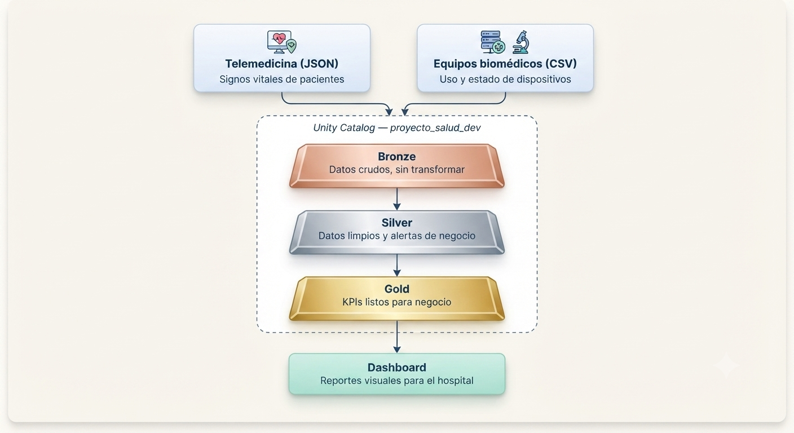
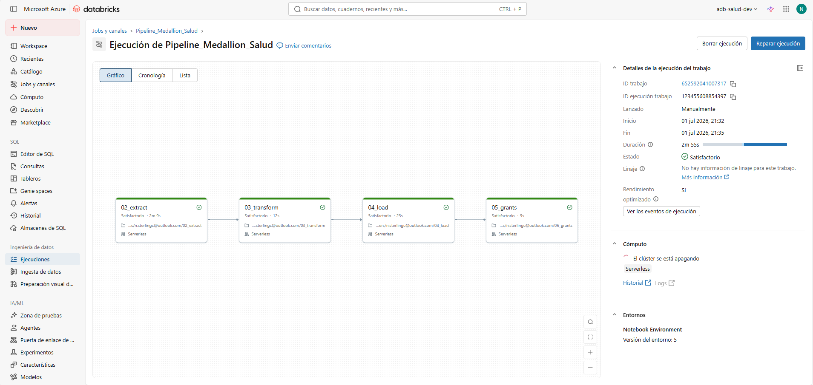
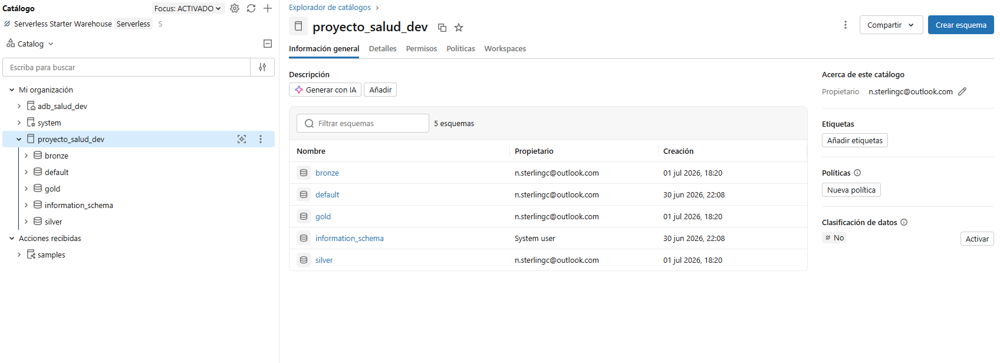
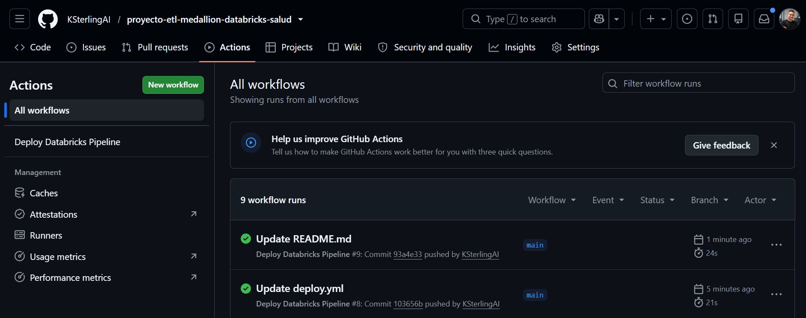
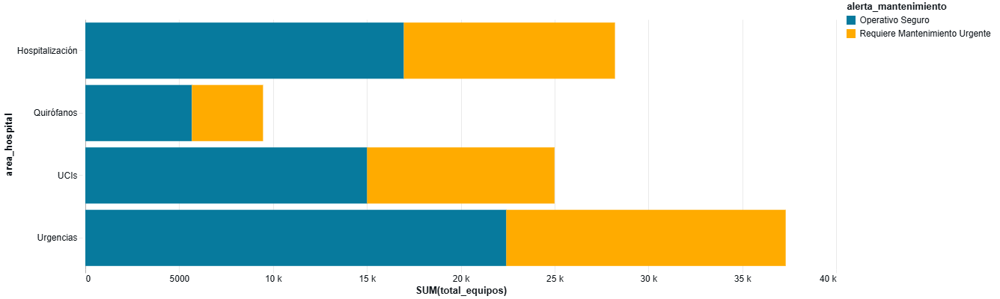
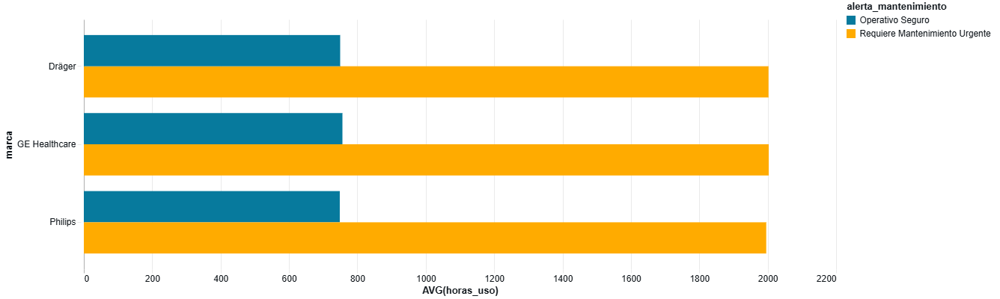
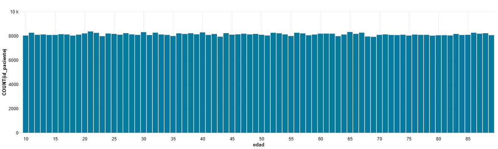

<h1 align="center">🏥 Pipeline de Datos en Azure Databricks — Sector Salud</h1>

  <b>Un pipeline de datos que une el monitoreo de pacientes y el estado de los equipos médicos en un solo lugar, de forma automática y ordenada.</b>

  
  
  
  

---

## ¿Qué hace este proyecto?

Imagina un hospital donde la información de los pacientes y la información de los equipos médicos viven en sistemas separados que no se hablan entre sí. Este proyecto resuelve eso: junta ambas fuentes de datos, las limpia, las organiza y genera reportes automáticos que ayudan a tomar decisiones más rápido.

Concretamente, este pipeline hace tres cosas:

1. **Recibe los datos crudos** de signos vitales de pacientes (telemedicina) y del uso de equipos biomédicos.
2. **Los limpia y les aplica reglas de negocio**, por ejemplo: marca a un paciente como "Riesgo Crítico" si su frecuencia cardíaca supera 100 o su oxigenación baja de 92.
3. **Genera reportes finales (KPIs)** listos para mostrar en un dashboard, como cuántos equipos necesitan mantenimiento urgente por área del hospital.

> 📌 Los datos usados son **sintéticos**, generados solo para fines de práctica y demostración técnica. No son datos reales de pacientes.

---

## El problema que resuelve

- El personal de salud no tiene visibilidad conjunta del estado del paciente y del estado de los equipos.
- El mantenimiento de equipos suele hacerse de forma reactiva (cuando ya fallaron), no preventiva.
- Detectar pacientes en riesgo depende de revisión manual, lo cual genera demoras.
- No existe control claro de quién puede ver qué datos.

Este pipeline ataca los cuatro puntos: junta las fuentes, automatiza las alertas, y aplica permisos de acceso por nivel de dato.

---

## Cómo está organizada la arquitectura

El proyecto sigue una arquitectura llamada **Medallion**, que organiza los datos en tres niveles, cada uno más "limpio" y más listo para negocio que el anterior:

  

- 🥉 **Bronze**: los datos tal como llegan, sin tocar. Es la copia fiel de la fuente original.
- 🥈 **Silver**: los datos ya limpios, con tipos de datos correctos y las alertas de negocio calculadas (riesgo del paciente, mantenimiento urgente del equipo).
- 🥇 **Gold**: los datos resumidos en reportes finales, listos para un dashboard o herramienta de análisis.

Todo esto vive dentro de **Unity Catalog**, que es el sistema de Databricks que organiza y protege los datos por catálogo, esquema y tabla.

---

## Tecnologías usadas

- **Azure Databricks** — la plataforma donde corre todo el procesamiento.
- **Apache Spark (PySpark y SQL)** — el motor que procesa los datos.
- **Delta Lake** — el formato de tabla que guarda los datos de forma confiable.
- **Unity Catalog** — el sistema de permisos y organización de datos.
- **GitHub Actions** — automatiza que cada cambio en el código se despliegue solo, sin pasos manuales.

---

## Estructura del repositorio

- `PrepAmb/` — prepara el ambiente inicial (crea el catálogo y los tres esquemas).
- `proceso/` — los scripts principales del pipeline, en orden:
  - `01_prep_amb.py` — crea el catálogo y los esquemas bronze, silver y gold.
  - `02_extract.py` — trae los datos crudos hacia la capa Bronze.
  - `03_transform.py` — limpia los datos y calcula las alertas hacia la capa Silver.
  - `04_load.py` — calcula los KPIs finales hacia la capa Gold.
  - `05_grants.py` — aplica los permisos de acceso.
- `seguridad/` — el script SQL con los permisos de acceso, documentado por separado.
- `reversion/` — script para reiniciar el pipeline desde cero si algo sale mal.
- `datasets/` — los datos de origen (sintéticos) usados como entrada.
- `dashboard/` — las imágenes de los KPIs finales.
- `evidencias/` — capturas que muestran que el pipeline corrió exitosamente.
- `.github/workflows/` — la automatización que despliega el proyecto solo.

---

## Cómo se ejecuta, paso a paso

1. Se prepara el ambiente: se crea el catálogo y los tres esquemas (`01_prep_amb.py`).
2. Se extraen los datos crudos desde el almacenamiento y se guardan en Bronze (`02_extract.py`).
3. Se limpian los datos y se calculan las alertas de negocio hacia Silver (`03_transform.py`).
4. Se generan los reportes finales hacia Gold (`04_load.py`).
5. Se aplican los permisos de acceso a cada capa (`05_grants.py`).

Todo esto corre automáticamente cada vez que se sube un cambio a la rama principal, gracias a GitHub Actions.

---

## Seguridad y control de acceso

No todos los datos deben ser visibles para todos. Por eso:

- La capa **Gold** (los reportes finales) es de lectura abierta para el equipo, pensada para consumirse en dashboards.
- Las capas **Bronze** y **Silver** tienen acceso más restringido, pensado solo para trazabilidad técnica.

Todos estos permisos están escritos como código en `seguridad/05_grants.sql`, así quedan documentados y se pueden revisar como cualquier otra parte del proyecto.

---

## Evidencias de que el pipeline funciona

**El proceso completo corrió exitosamente de principio a fin:**

**Los datos quedaron organizados y gobernados en Unity Catalog:**

**El despliegue automático funcionó con GitHub Actions:**

---

## Resultados: los reportes finales

  
  

  
  

Con estos reportes, un hospital podría responder preguntas como: ¿qué áreas tienen más equipos que necesitan mantenimiento urgente?, ¿qué marcas de equipos se desgastan más rápido?, y ¿cómo está distribuido el riesgo entre los pacientes críticos?

---
